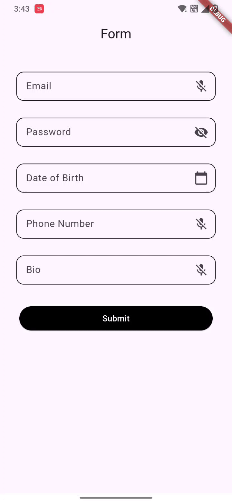

# voice_formly

`voice_formly` is a customizable Flutter form field widget that adds **built-in validation** and **speech-to-text input** support. It simplifies voice-powered form handling and allows users to build accessible and modern form experiences faster.

---

## ✨ Features

- 🎤 Voice input (speech-to-text) for supported fields (text, email, phone, multiline, etc.)
- 🛡️ Built-in smart validation for common fields (email, number, phone)
- 🧠 Custom validation support
- 🧾 Multiple field types: text, email, password, phone, date, multiline, number
- 🎨 Easily configurable with styling, hints, borders, icons
- 📆 Integrated date picker for date fields

---


## 📸 Screenshots
<table>
  <tr>
    <th>Validation Error</th>
    <th>Voice Input in Action</th>
  </tr>
  <tr>
    <td></td>
    <td></td>
  </tr>
</table>

---


## 🚀 Getting started

Add the package to your `pubspec.yaml`:

```yaml
dependencies:
  voice_formly: ^0.0.1  
````

Import it in your Dart file:

```dart
import 'package:voice_formly/voice_formly.dart';
```

---

## 💡 Usage Example

```dart
VoiceFormField(
  controller: myController,
  fieldId: 'email',
  label: 'Email Address',
  fieldType: FormFieldType.email,
  enableVoice: true,
  validator: (value) {
    if (value == null || value.isEmpty) return 'Enter your email';
    return null;
  },
  onMicTap: (fieldId) {
    print("Mic tapped on field: $fieldId");
  },
)
```

---

## 🧾 VoiceFormField Parameters

| Parameter              | Type                                      | Description                                                                 |
|------------------------|-------------------------------------------|-----------------------------------------------------------------------------|
| `fieldId`              | `String`                                  | Unique identifier for the field (used with callbacks).                     |
| `onMicTap`             | `Function(String fieldId)?`               | Callback function when the mic icon is tapped.                             |
| `controller`           | `TextEditingController`                   | Controller for managing the text input.                                    |
| `hint`                 | `String?`                                  | Placeholder or hint shown inside the field.                                |
| `height`               | `int?`                                     | Custom height of the field in logical pixels.                              |
| `width`                | `int?`                                     | Custom width of the field in logical pixels.                               |
| `fontSize`             | `int`                                      | Font size of the input text.                                               |
| `maxLines`             | `int?`                                     | Maximum number of lines (useful for multiline fields).                     |
| `minLines`             | `int?`                                     | Minimum number of lines.                                                   |
| `errorMaxLines`        | `int?`                                     | Maximum number of lines for the error message.                             |
| `keyboardType`         | `TextInputType?`                           | Keyboard input type (text, email, number, etc.).                           |
| `borderColor`          | `Color`                                    | Border color when the field is focused.                                    |
| `label`                | `String?`                                  | Label shown above the field.                                               |
| `enableVoice`          | `bool`                                     | Whether to enable voice input functionality.                               |
| `suffixIconButton`     | `IconButton?`                              | Custom suffix icon at the end of the field.                                |
| `autofocus`            | `bool?`                                    | Whether to autofocus the field on load.                                    |
| `autocorrect`          | `bool?`                                    | Whether to enable autocorrect for the input.                               |
| `textInputAction`      | `TextInputAction?`                         | The action button on the keyboard (e.g., done, next).                      |
| `autoValidateMode`     | `AutovalidateMode?`                        | Controls when to auto-validate the field (e.g., always, onUserInteraction).|
| `padding`              | `EdgeInsets?`                              | Custom padding inside the form field.                                      |
| `validator`            | `String? Function(String?)?`              | Custom validation logic.                                                   |
| `fieldType`            | `FormFieldType`                            | Determines behavior (e.g., text, email, password, date).                   |
| `enabledBorder`        | `InputBorder?`                             | Border style when field is enabled.                                        |
| `border`               | `InputBorder?`                             | Default border style.                                                      |
| `focusedErrorBorder`   | `InputBorder?`                             | Border style when field has focus and an error.                            |
| `focusedBorder`        | `InputBorder?`                             | Border style when field is focused.                                        |
| `errorBorder`          | `InputBorder?`                             | Border style when validation fails.                                        |
| `disabledBorder`       | `InputBorder?`                             | Border style when the field is disabled.                                   |

## 📄 License

This project is licensed under the **MIT License** – see the [LICENSE](LICENSE) file for details.

```
MIT License

Copyright (c) 2025 Gresey Patidar

Permission is hereby granted, free of charge, to any person obtaining a copy
of this software and associated documentation files (the "Software"), to deal
in the Software without restriction, including without limitation the rights
to use, copy, modify, merge, publish, distribute, sublicense, and/or sell
copies of the Software, and to permit persons to whom the Software is
furnished to do so, subject to the following conditions:

The above copyright notice and this permission notice shall be included in all
copies or substantial portions of the Software.

THE SOFTWARE IS PROVIDED "AS IS", WITHOUT WARRANTY OF ANY KIND, EXPRESS OR
IMPLIED, INCLUDING BUT NOT LIMITED TO THE WARRANTIES OF MERCHANTABILITY,
FITNESS FOR A PARTICULAR PURPOSE AND NONINFRINGEMENT. IN NO EVENT SHALL THE
AUTHORS OR COPYRIGHT HOLDERS BE LIABLE FOR ANY CLAIM, DAMAGES OR OTHER
LIABILITY, WHETHER IN AN ACTION OF CONTRACT, TORT OR OTHERWISE, ARISING FROM,
OUT OF OR IN CONNECTION WITH THE SOFTWARE OR THE USE OR OTHER DEALINGS IN THE
SOFTWARE.